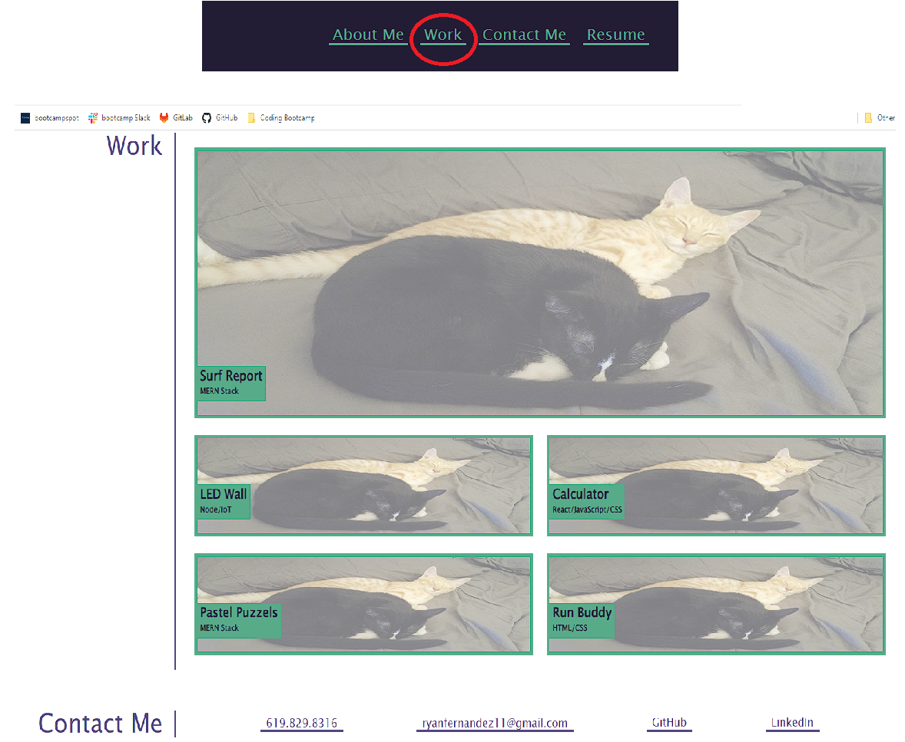
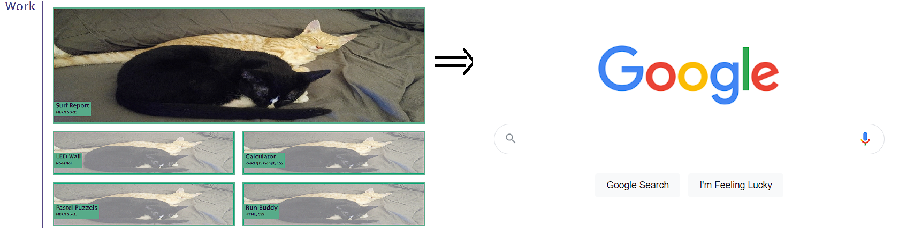
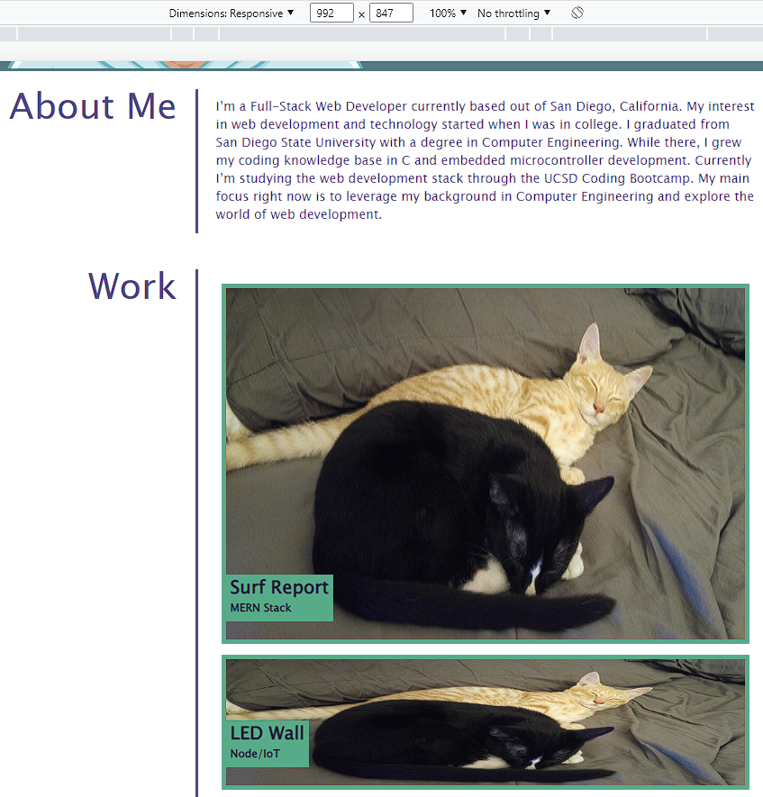
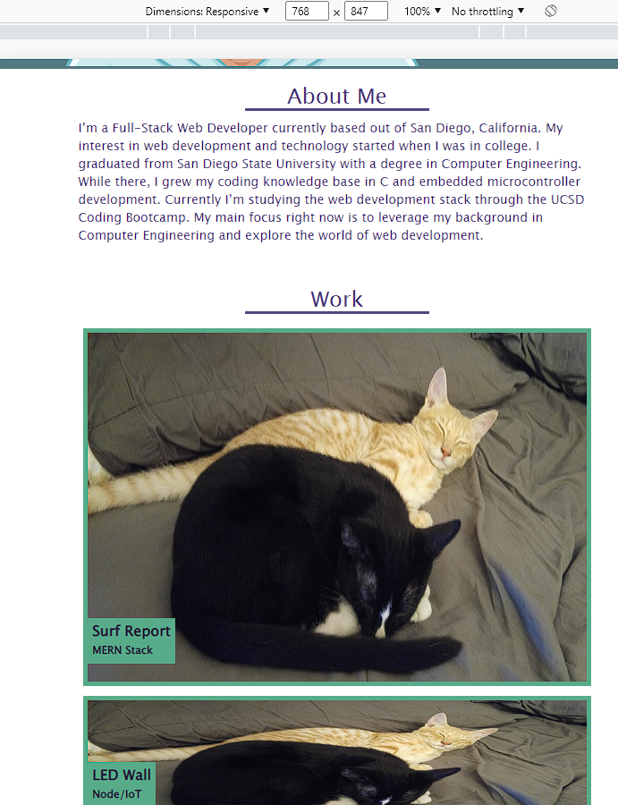

# My Portfolio

## Description

My motivation for this project was to build a portfolio for showcasing my work as a web developer while completing
the UCSD Coding Bootcamp. This portfolio was made to highlight my strongest works, linking to their deployed 
applications (once completed). This project solves the problem of having one centralized location to display my
skills and aid as a tool for my career search following the bootcamp. In this project I learned create a website using
the base tools of HTML and CSS, while applying the core skills of flexbox, media queries, CSS selectors, and CSS variables.

## Installation

N/A

## Usage

To use this website, there is a navigation bar containing links that can be used to navigate to different sections of
the webpage. For example, clicking on the "Work" link will scroll the webpage down to the "Work" section, that contains
title cards to deployed applications (currently placeholder images, titles, and links are in place).

In the "Work" section, title cards for deployed applications can be seen. By default, each title card is set to half
opacity. Once when moused over, the opacity of the selected card will transition to 100%, bringing emphasis to the 
selected card. When clicked, the user will be brought to the deployed application (currently linking to google.com).

This project showcases the use of media queries and responsive design by adjusting the webpage according to the user's
current viewport. At viewports between 992px and 768px, the webpage is optimized for tablet use and shifts the 
application title cards to be displayed in a single column. Since tablet users make the use of touchscreens and 
cannot hover over their selections, the opacity of the images is set to 100%.

For viewports at 768px and under, the webpage is optimized for Smartphone use. To accomodate for the smaller viewport,
the section headings are moved from the left of each section, to the top of each section. Similar to tablet users,
the title cards are displayed with a flexbox column orientation.

The "Contact Me" section contains the best methods for contacting me, along with relevant links related to my work. 
The GitHub link connects the user to my GitHub profile, while a placeholder is currently used for my LinkedIn.

## Credits

N/A

## License

N/A